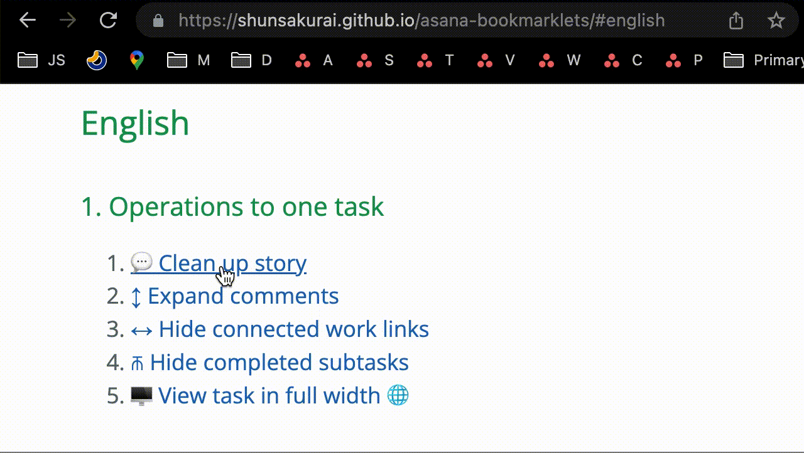

<h1 style="display: none;">Asana Bookmarklets</h1>

# How to use

Drag and drop the links below to your browser bookmark bar.
For details, please see <a href="https://forum.asana.com/t/introduction-to-asana-bookmarklets/184620" target="_blank" rel="noopener noreferrer">this forum topic</a>.

Bookmarklets with the 🌐 icon are new and their names are only available in EN and JA. You can still add and rename those bookmarklets for other languages.

# Table of Contents
- [English](#english)
- [日本語](#日本語)
- [Deutsch](#deutsch)
- [Français](#français)
- [Español](#español)
- [Português](#português)

# English

## 1. Operations to one task

1. <a href="javascript: (function() {const expandLink = document.querySelector('.TaskStoryFeed-expandLink');if (expandLink && expandLink.textContent.match(/\d/)) expandLink.click();  document.querySelectorAll('.TruncatedRichText-expand').forEach(link => link.click());  document.querySelectorAll('.TaskStoryFeed-expandMiniStoriesLink').forEach(link => link.click());document.querySelectorAll('.BacklinkMiniStory').forEach(line => {line.parentNode.style.display = 'none';});})();">💬 Clean up story</a>
1. <a href="javascript:(function() { const expandLink = document.querySelector('.TaskStoryFeed-expandLink'); if (expandLink && expandLink.textContent.match(/\d/)) expandLink.click(); document.querySelectorAll('.TruncatedRichText-expand').forEach(link => link.click()); document.querySelectorAll('.TaskStoryFeed-expandMiniStoriesLink').forEach(link => link.click()); })();">↕️ Expand comments</a>
1. <a href="javascript:(function() { document.querySelectorAll('.BacklinkMiniStory').forEach(line => {line.parentNode.style.display = 'none';}); })();">↔ Hide connected work links</a>
1. <a href="javascript:(function() {const completedSubtaskRows = document.querySelectorAll('.SubtaskTaskRow--completed');completedSubtaskRows.forEach(row => {row.parentNode.parentNode.style.display = row.parentNode.parentNode.style.display?%20%27%27:%20%27none%27;});})();">⫚ Hide completed subtasks</a>
1. <a href="javascript:(function() {const focusModePane = document.querySelector('.Pane.FocusModePage-taskPane');if (focusModePane) {if (focusModePane.style.flexBasis == 'auto') {focusModePane.style.flexBasis = '';focusModePane.style.width = '';} else {focusModePane.style.flexBasis = 'auto';focusModePane.style.width = '100%';}}const detailsOverlay = document.querySelector('.FullWidthPageStructureWithDetailsOverlay-detailsOverlay');if (detailsOverlay) {if (!detailsOverlay.style.maxWidth) {detailsOverlay.style.maxWidth = '75%';detailsOverlay.style.width = '75%';} else {detailsOverlay.style.maxWidth = '700px';detailsOverlay.style.width = '55%';}}})();">🖥 View task in full width</a> 🌐

## 2. Operations to a list of tasks
> Note: If there are many tasks and some are not displayed in the window, **scroll Asana tab to the bottom** to load all tasks **before running these bookmarklets**.

1. <a href="javascript:(function() { const firstButtonIcon = document.querySelector('.TaskGroupHeader-toggleButton .Icon'); if (!firstButtonIcon) return; const firstTriangleClassName = firstButtonIcon.classList.contains('DownTriangleIcon')? 'DownTriangleIcon': 'RightTriangleIcon'; document.querySelectorAll(`.TaskGroupHeader-toggleButton .${firstTriangleClassName}`).forEach(buttonIcon => buttonIcon.parentNode.click()); })();">▶︎ Toggle sections</a>
1. <a href="javascript:(function() {const boardSubtaskToggleButtons = document.querySelectorAll('.SubtaskCountToggleButton');if (boardSubtaskToggleButtons.length) {boardSubtaskToggleButtons.forEach(button => button.click());return;}const firstListSubtaskButton = document.querySelector('.ProjectSpreadsheetGridRow-subtaskToggleButton');if (!firstListSubtaskButton) return;const firstTriangleClassName = firstListSubtaskButton.firstElementChild.classList.contains('DownTriangleIcon')? %27DownTriangleIcon%27: %27RightTriangleIcon%27;const taskPlaceholderHTMLCollection = document.getElementsByClassName(%27SpreadsheetTaskRowScrollPlaceholder%27);const taskGroup = document.querySelector(%27.TaskGroup%27);const buttonAtTheBottom = document.querySelector(%27.SpreadsheetPotGridContents-addSectionButton%27);setTimeout(function () {if (buttonAtTheBottom) buttonAtTheBottom.scrollIntoView();}, 30);setTimeout(function () {taskGroup.style.display = %27none%27;}, 60);let monitorTaskStructure = setInterval(() => {if (taskPlaceholderHTMLCollection.length == 0) {document.querySelectorAll(%27.ProjectSpreadsheetGridRow-subtaskToggleButton%27).forEach(function (buttonIcon) {if (buttonIcon.firstElementChild.classList.contains(firstTriangleClassName)) buttonIcon.click();});taskGroup.style.display = %27%27;clearInterval(monitorTaskStructure);const loadMoreLinkHTMLCollection = document.getElementsByClassName(%27SpreadsheetTaskList-showMoreLink%27);setTimeout(() => {let clickingLoadMoreLinks = setInterval(function() {if (!loadMoreLinkHTMLCollection.length) {clearInterval(clickingLoadMoreLinks);} else {loadMoreLinkHTMLCollection[0].scrollIntoView();loadMoreLinkHTMLCollection[0].click();}}, 100);}, 200);}}, 100);})();">▷ Toggle subtasks</a>
1. <a href="javascript:(function() { const taskPlaceholderHTMLCollection = document.getElementsByClassName('SpreadsheetTaskRowScrollPlaceholder'); if (!taskPlaceholderHTMLCollection.length) { document.querySelectorAll('.TaskRowCompletionStatus-taskCompletionIcon--incomplete').forEach(incompleteIcon => incompleteIcon.parentNode.click()); } else { const taskGroup = document.querySelector('.TaskGroup'); const buttonAtTheBottom = document.querySelector('.SpreadsheetPotGridContents-addSectionButton'); setTimeout(function () {if (buttonAtTheBottom) buttonAtTheBottom.scrollIntoView();}, 30); setTimeout(function () { taskGroup.style.display = 'none'; const progressIndicator = document.createElement('span'); progressIndicator.setAttribute('id', 'progressIndicator'); progressIndicator.textContent = 'Processing'; taskGroup.parentNode.appendChild(progressIndicator); }, 60); let monitorTaskStructure = setInterval(() => { if (taskPlaceholderHTMLCollection.length == 0) { clearInterval(monitorTaskStructure); const progressIndicator = document.querySelector('#progressIndicator'); const allTasks = Array.from(document.querySelectorAll('.TaskRowCompletionStatus-taskCompletionIcon--incomplete')); const numProcesses = Math.floor(allTasks.length / 50) + 1; let counter = 0; let loopTasks = setInterval(() => { progressIndicator.textContent = `Processing (${counter}/${numProcesses})`; for (let i = 50 * counter; i < Math.min(allTasks.length, 50 * (counter + 1)); i++) { allTasks[i].parentNode.click(); if (i == allTasks.length - 1) { clearInterval(loopTasks); progressIndicator.remove(); taskGroup.style.display = ''; } } counter += 1; }, 500); } }, 100); } })();">✅ Complete all tasks</a>
1. <a href="javascript:(function() { const taskPlaceholderHTMLCollection = document.getElementsByClassName('SpreadsheetTaskRowScrollPlaceholder'); if (!taskPlaceholderHTMLCollection.length) { document.querySelectorAll('.TaskRowCompletionStatus-taskCompletionIcon--complete').forEach(incompleteIcon => incompleteIcon.parentNode.click()); } else { const taskGroup = document.querySelector('.TaskGroup'); const buttonAtTheBottom = document.querySelector('.SpreadsheetPotGridContents-addSectionButton'); setTimeout(function () {if (buttonAtTheBottom) buttonAtTheBottom.scrollIntoView();}, 30); setTimeout(function () { taskGroup.style.display = 'none'; const progressIndicator = document.createElement('span'); progressIndicator.setAttribute('id', 'progressIndicator'); progressIndicator.textContent = 'Processing'; taskGroup.parentNode.appendChild(progressIndicator); }, 60); let monitorTaskStructure = setInterval(() => { if (taskPlaceholderHTMLCollection.length == 0) { clearInterval(monitorTaskStructure); const progressIndicator = document.querySelector('#progressIndicator'); const allTasks = Array.from(document.querySelectorAll('.TaskRowCompletionStatus-taskCompletionIcon--complete')); const numProcesses = Math.floor(allTasks.length / 50) + 1; let counter = 0; let loopTasks = setInterval(() => { progressIndicator.textContent = `Processing(${counter}/${numProcesses})`; for (let i = 50 * counter; i < Math.min(allTasks.length, 50 * (counter + 1)); i++) { allTasks[i].parentNode.click(); if (i == allTasks.length - 1) { clearInterval(loopTasks); progressIndicator.remove(); taskGroup.style.display = ''; } } counter += 1; }, 500); } }, 100); } })();">☑️ Mark all tasks incomplete</a>
1. <a href="javascript:(function() {const filterMenu = [...document.querySelectorAll('.PageToolbarStructure-rightChildren div')].find((node) => node.innerText.startsWith('Filter'));if (!filterMenu) return;filterMenu.click();setTimeout(() => {const filterMenuContents = document.querySelector('.FilterMenuContents');if (filterMenuContents) {const removeButton = filterMenuContents.querySelector('.RemoveButton');removeButton.click();} else {const justMyTasks = document.getElementById('view_options_filter_Just my tasks');if (justMyTasks) justMyTasks.click();}}, 250);})();">👤 Just My Tasks</a> 🌐 <small>(Provided by [John_Pope](https://forum.asana.com/u/john_pope) in this [comment](https://forum.asana.com/t/introduction-to-asana-bookmarklets/184620/16)</small>

## 3. Other operations
1. <a href="javascript:(function() {const widerWidth = '480px';const asanaSidebar = document.querySelector('.AsanaMain-sidebar');if (!asanaSidebar) return; var newStyle = document.querySelector('#asanaSidebarBookmarkletStyle');if (!newStyle) {newStyle = document.createElement('style');newStyle.id = 'asanaSidebarBookmarkletStyle';document.head.appendChild(newStyle);}if (asanaSidebar.style.width == widerWidth) {asanaSidebar.style.width = '240px';newStyle.innerText = '';} else {asanaSidebar.style.width = widerWidth;newStyle.innerText = %60.AsanaMain-sidebar.AsanaMain-sidebar--isCollapsed {margin-left: -${widerWidth} !important}%60;}})();">☰ Resize sidebar</a> <small>(Inspired by [Ian_Houser](https://forum.asana.com/t/sidebar-adjust-size-width/27297/14)'s [bookmarklet](https://ianhouser.github.io/asana-bookmarklets/))</small>

# 日本語

以下のリンクをブックマークバーにドラッグ＆ドロップして追加してください。
詳細については<a href="https://forum.asana.com/t/asana/184069" target="_blank" rel="noopener noreferrer">こちらのフォーラム投稿</a>をご覧ください。

## 1. 一つのタスクに対する操作

1. <a href="javascript: (function() {const expandLink = document.querySelector('.TaskStoryFeed-expandLink');if (expandLink && expandLink.textContent.match(/\d/)) expandLink.click();  document.querySelectorAll('.TruncatedRichText-expand').forEach(link => link.click());  document.querySelectorAll('.TaskStoryFeed-expandMiniStoriesLink').forEach(link => link.click());document.querySelectorAll('.BacklinkMiniStory').forEach(line => {line.parentNode.style.display = 'none';});})();">💬 ストーリーのスッキリ表示</a>
1. <a href="javascript:(function() { const expandLink = document.querySelector('.TaskStoryFeed-expandLink'); if (expandLink && expandLink.textContent.match(/\d/)) expandLink.click(); document.querySelectorAll('.TruncatedRichText-expand').forEach(link => link.click()); document.querySelectorAll('.TaskStoryFeed-expandMiniStoriesLink').forEach(link => link.click()); })();">↕️ コメントの展開</a>
1. <a href="javascript:(function() { document.querySelectorAll('.BacklinkMiniStory').forEach(line => {line.parentNode.style.display = 'none';}); })();">↔ 作業間リンクの非表示</a>
1. <a href="javascript:(function() {const completedSubtaskRows = document.querySelectorAll('.SubtaskTaskRow--completed');completedSubtaskRows.forEach(row => {row.parentNode.parentNode.style.display = row.parentNode.parentNode.style.display? %27%27: %27none%27;});})();">⫚ 完了したサブタスクの非表示</a>
1. <a href="javascript:(function() {const focusModePane = document.querySelector('.Pane.FocusModePage-taskPane');if (focusModePane) {if (focusModePane.style.flexBasis == 'auto') {focusModePane.style.flexBasis = '';focusModePane.style.width = '';} else {focusModePane.style.flexBasis = 'auto';focusModePane.style.width = '100%';}}const detailsOverlay = document.querySelector('.FullWidthPageStructureWithDetailsOverlay-detailsOverlay');if (detailsOverlay) {if (!detailsOverlay.style.maxWidth) {detailsOverlay.style.maxWidth = '75%';detailsOverlay.style.width = '75%';} else {detailsOverlay.style.maxWidth = '700px';detailsOverlay.style.width = '55%';}}})();">🖥 タスクの全幅表示</a> 🌐

## 2. プロジェクトなどタスクリストに対する操作
> 注意: タスクが多数あり一画面に表示しきれていない場合は、以下の**ブックマークレットを実行する前に、Asana画面を一番下までスクロール**し、すべてのタスクを読み込んでください。

1. <a href="javascript:(function() { const firstButtonIcon = document.querySelector('.TaskGroupHeader-toggleButton .Icon'); if (!firstButtonIcon) return; const firstTriangleClassName = firstButtonIcon.classList.contains('DownTriangleIcon')? 'DownTriangleIcon': 'RightTriangleIcon'; document.querySelectorAll(`.TaskGroupHeader-toggleButton .${firstTriangleClassName}`).forEach(buttonIcon => buttonIcon.parentNode.click()); })();">▶︎ セクションの表示切り替え</a>
1. <a href="javascript:(function() {const boardSubtaskToggleButtons = document.querySelectorAll('.SubtaskCountToggleButton');if (boardSubtaskToggleButtons.length) {boardSubtaskToggleButtons.forEach(button => button.click());return;}const firstListSubtaskButton = document.querySelector('.ProjectSpreadsheetGridRow-subtaskToggleButton');if (!firstListSubtaskButton) return;const firstTriangleClassName = firstListSubtaskButton.firstElementChild.classList.contains('DownTriangleIcon')? %27DownTriangleIcon%27: %27RightTriangleIcon%27;const taskPlaceholderHTMLCollection = document.getElementsByClassName(%27SpreadsheetTaskRowScrollPlaceholder%27);const taskGroup = document.querySelector(%27.TaskGroup%27);const buttonAtTheBottom = document.querySelector(%27.SpreadsheetPotGridContents-addSectionButton%27);setTimeout(function () {if (buttonAtTheBottom) buttonAtTheBottom.scrollIntoView();}, 30);setTimeout(function () {taskGroup.style.display = %27none%27;}, 60);let monitorTaskStructure = setInterval(() => {if (taskPlaceholderHTMLCollection.length == 0) {document.querySelectorAll(%27.ProjectSpreadsheetGridRow-subtaskToggleButton%27).forEach(function (buttonIcon) {if (buttonIcon.firstElementChild.classList.contains(firstTriangleClassName)) buttonIcon.click();});taskGroup.style.display = %27%27;clearInterval(monitorTaskStructure);const loadMoreLinkHTMLCollection = document.getElementsByClassName(%27SpreadsheetTaskList-showMoreLink%27);setTimeout(() => {let clickingLoadMoreLinks = setInterval(function() {if (!loadMoreLinkHTMLCollection.length) {clearInterval(clickingLoadMoreLinks);} else {loadMoreLinkHTMLCollection[0].scrollIntoView();loadMoreLinkHTMLCollection[0].click();}}, 100);}, 200);}}, 100);})();">▷ サブタスクの表示切り替え</a>
1. <a href="javascript:(function() { const taskPlaceholderHTMLCollection = document.getElementsByClassName('SpreadsheetTaskRowScrollPlaceholder'); if (!taskPlaceholderHTMLCollection.length) { document.querySelectorAll('.TaskRowCompletionStatus-taskCompletionIcon--incomplete').forEach(incompleteIcon => incompleteIcon.parentNode.click()); } else { const taskGroup = document.querySelector('.TaskGroup'); const buttonAtTheBottom = document.querySelector('.SpreadsheetPotGridContents-addSectionButton'); setTimeout(function () {if (buttonAtTheBottom) buttonAtTheBottom.scrollIntoView();}, 30); setTimeout(function () { taskGroup.style.display = 'none'; const progressIndicator = document.createElement('span'); progressIndicator.setAttribute('id', 'progressIndicator'); progressIndicator.textContent = '処理しています'; taskGroup.parentNode.appendChild(progressIndicator); }, 60); let monitorTaskStructure = setInterval(() => { if (taskPlaceholderHTMLCollection.length == 0) { clearInterval(monitorTaskStructure); const progressIndicator = document.querySelector('#progressIndicator'); const allTasks = Array.from(document.querySelectorAll('.TaskRowCompletionStatus-taskCompletionIcon--incomplete')); const numProcesses = Math.floor(allTasks.length / 50) + 1; let counter = 0; let loopTasks = setInterval(() => { progressIndicator.textContent = `処理しています (${counter}/${numProcesses}）`; for (let i = 50 * counter; i < Math.min(allTasks.length, 50 * (counter + 1)); i++) { allTasks[i].parentNode.click(); if (i == allTasks.length - 1) { clearInterval(loopTasks); progressIndicator.remove(); taskGroup.style.display = ''; } } counter += 1; }, 500); } }, 100); } })();">✅ すべてのタスクの完了</a>
1. <a href="javascript:(function() { const taskPlaceholderHTMLCollection = document.getElementsByClassName('SpreadsheetTaskRowScrollPlaceholder'); if (!taskPlaceholderHTMLCollection.length) { document.querySelectorAll('.TaskRowCompletionStatus-taskCompletionIcon--complete').forEach(incompleteIcon => incompleteIcon.parentNode.click()); } else { const taskGroup = document.querySelector('.TaskGroup'); const buttonAtTheBottom = document.querySelector('.SpreadsheetPotGridContents-addSectionButton'); setTimeout(function () {if (buttonAtTheBottom) buttonAtTheBottom.scrollIntoView();}, 30); setTimeout(function () { taskGroup.style.display = 'none'; const progressIndicator = document.createElement('span'); progressIndicator.setAttribute('id', 'progressIndicator'); progressIndicator.textContent = '処理しています'; taskGroup.parentNode.appendChild(progressIndicator); }, 60); let monitorTaskStructure = setInterval(() => { if (taskPlaceholderHTMLCollection.length == 0) { clearInterval(monitorTaskStructure); const progressIndicator = document.querySelector('#progressIndicator'); const allTasks = Array.from(document.querySelectorAll('.TaskRowCompletionStatus-taskCompletionIcon--complete')); const numProcesses = Math.floor(allTasks.length / 50) + 1; let counter = 0; let loopTasks = setInterval(() => { progressIndicator.textContent = `処理しています (${counter}/${numProcesses}）`; for (let i = 50 * counter; i < Math.min(allTasks.length, 50 * (counter + 1)); i++) { allTasks[i].parentNode.click(); if (i == allTasks.length - 1) { clearInterval(loopTasks); progressIndicator.remove(); taskGroup.style.display = ''; } } counter += 1; }, 500); } }, 100); } })();">☑️ すべてのタスクの未完了</a>
1. <a href="javascript:(function() {const filterMenu = [...document.querySelectorAll('.PageToolbarStructure-rightChildren div')].find((node) => node.innerText.startsWith('Filter'));if (!filterMenu) return;filterMenu.click();setTimeout(() => {const filterMenuContents = document.querySelector('.FilterMenuContents');if (filterMenuContents) {const removeButton = filterMenuContents.querySelector('.RemoveButton');removeButton.click();} else {const justMyTasks = document.getElementById('view_options_filter_Just my tasks');if (justMyTasks) justMyTasks.click();}}, 250);})();">👤 マイタスクのみ</a> 🌐

## 3. その他の操作
1. <a href="javascript:(function() {const widerWidth = '480px';const asanaSidebar = document.querySelector('.AsanaMain-sidebar');if (!asanaSidebar) return; var newStyle = document.querySelector('#asanaSidebarBookmarkletStyle');if (!newStyle) {newStyle = document.createElement('style');newStyle.id = 'asanaSidebarBookmarkletStyle';document.head.appendChild(newStyle);}if (asanaSidebar.style.width == widerWidth) {asanaSidebar.style.width = '240px';newStyle.innerText = '';} else {asanaSidebar.style.width = widerWidth;newStyle.innerText = %60.AsanaMain-sidebar.AsanaMain-sidebar--isCollapsed {margin-left: -${widerWidth} !important}%60;}})();">☰ サイドバーのサイズ変更</a>

# Deutsch

## 1. Vorgänge für eine Aufgabe

1. <a href="javascript: (function() {const expandLink = document.querySelector('.TaskStoryFeed-expandLink');if (expandLink && expandLink.textContent.match(/\d/)) expandLink.click();  document.querySelectorAll('.TruncatedRichText-expand').forEach(link => link.click());  document.querySelectorAll('.TaskStoryFeed-expandMiniStoriesLink').forEach(link => link.click());document.querySelectorAll('.BacklinkMiniStory').forEach(line => {line.parentNode.style.display = 'none';});})();">💬 Story-Bereinigung</a>
1. <a href="javascript:(function() { const expandLink = document.querySelector('.TaskStoryFeed-expandLink'); if (expandLink && expandLink.textContent.match(/\d/)) expandLink.click(); document.querySelectorAll('.TruncatedRichText-expand').forEach(link => link.click()); document.querySelectorAll('.TaskStoryFeed-expandMiniStoriesLink').forEach(link => link.click()); })();">↕️ Kommentare ausklappen</a>
1. <a href="javascript:(function() { document.querySelectorAll('.BacklinkMiniStory').forEach(line => {line.parentNode.style.display = 'none';}); })();">↔ Verknüpfte Arbeitslinks ausblenden</a>
1. <a href="javascript:(function() {const completedSubtaskRows = document.querySelectorAll('.SubtaskTaskRow--completed');completedSubtaskRows.forEach(row => {row.parentNode.parentNode.style.display = row.parentNode.parentNode.style.display? %27%27: %27none%27;});})();">⫚ Erledigte Aufgaben ausblenden</a>

## 2. Vorgänge in einer Liste von Aufgaben (z. B. in einem Projekt)
> Hinweis: Wenn bei einer großen Anzahl von Aufgaben einige nicht im Fenster erscheinen, scrollen Sie einfach den Asana-Tab nach unten, um alle Aufgaben zu laden, bevor Sie diese Bookmarklets aufrufen.

1. <a href="javascript:(function() { const firstButtonIcon = document.querySelector('.TaskGroupHeader-toggleButton .Icon'); if (!firstButtonIcon) return; const firstTriangleClassName = firstButtonIcon.classList.contains('DownTriangleIcon')? 'DownTriangleIcon': 'RightTriangleIcon'; document.querySelectorAll(`.TaskGroupHeader-toggleButton .${firstTriangleClassName}`).forEach(buttonIcon => buttonIcon.parentNode.click()); })();">▶︎ Zwischen Abschnitten hin- und herwechseln</a>
1. <a href="javascript:(function() {const boardSubtaskToggleButtons = document.querySelectorAll('.SubtaskCountToggleButton');if (boardSubtaskToggleButtons.length) {boardSubtaskToggleButtons.forEach(button => button.click());return;}const firstListSubtaskButton = document.querySelector('.ProjectSpreadsheetGridRow-subtaskToggleButton');if (!firstListSubtaskButton) return;const firstTriangleClassName = firstListSubtaskButton.firstElementChild.classList.contains('DownTriangleIcon')? %27DownTriangleIcon%27: %27RightTriangleIcon%27;const taskPlaceholderHTMLCollection = document.getElementsByClassName(%27SpreadsheetTaskRowScrollPlaceholder%27);const taskGroup = document.querySelector(%27.TaskGroup%27);const buttonAtTheBottom = document.querySelector(%27.SpreadsheetPotGridContents-addSectionButton%27);setTimeout(function () {if (buttonAtTheBottom) buttonAtTheBottom.scrollIntoView();}, 30);setTimeout(function () {taskGroup.style.display = %27none%27;}, 60);let monitorTaskStructure = setInterval(() => {if (taskPlaceholderHTMLCollection.length == 0) {document.querySelectorAll(%27.ProjectSpreadsheetGridRow-subtaskToggleButton%27).forEach(function (buttonIcon) {if (buttonIcon.firstElementChild.classList.contains(firstTriangleClassName)) buttonIcon.click();});taskGroup.style.display = %27%27;clearInterval(monitorTaskStructure);const loadMoreLinkHTMLCollection = document.getElementsByClassName(%27SpreadsheetTaskList-showMoreLink%27);setTimeout(() => {let clickingLoadMoreLinks = setInterval(function() {if (!loadMoreLinkHTMLCollection.length) {clearInterval(clickingLoadMoreLinks);} else {loadMoreLinkHTMLCollection[0].scrollIntoView();loadMoreLinkHTMLCollection[0].click();}}, 100);}, 200);}}, 100);})();">▷ Unteraufgaben ein- und ausblenden</a>
1. <a href="javascript:(function() { const taskPlaceholderHTMLCollection = document.getElementsByClassName('SpreadsheetTaskRowScrollPlaceholder'); if (!taskPlaceholderHTMLCollection.length) { document.querySelectorAll('.TaskRowCompletionStatus-taskCompletionIcon--incomplete').forEach(incompleteIcon => incompleteIcon.parentNode.click()); } else { const taskGroup = document.querySelector('.TaskGroup'); const buttonAtTheBottom = document.querySelector('.SpreadsheetPotGridContents-addSectionButton'); setTimeout(function () {if (buttonAtTheBottom) buttonAtTheBottom.scrollIntoView();}, 30); setTimeout(function () { taskGroup.style.display = 'none'; const progressIndicator = document.createElement('span'); progressIndicator.setAttribute('id', 'progressIndicator'); progressIndicator.textContent = 'Wird ausgeführt'; taskGroup.parentNode.appendChild(progressIndicator); }, 60); let monitorTaskStructure = setInterval(() => { if (taskPlaceholderHTMLCollection.length == 0) { clearInterval(monitorTaskStructure); const progressIndicator = document.querySelector('#progressIndicator'); const allTasks = Array.from(document.querySelectorAll('.TaskRowCompletionStatus-taskCompletionIcon--incomplete')); const numProcesses = Math.floor(allTasks.length / 50) + 1; let counter = 0; let loopTasks = setInterval(() => { progressIndicator.textContent = `Wird ausgeführt (${counter}/${numProcesses}）`; for (let i = 50 * counter; i < Math.min(allTasks.length, 50 * (counter + 1)); i++) { allTasks[i].parentNode.click(); if (i == allTasks.length - 1) { clearInterval(loopTasks); progressIndicator.remove(); taskGroup.style.display = ''; } } counter += 1; }, 500); } }, 100); } })();">✅ Alle Aufgaben erledigen</a>
1. <a href="javascript:(function() { const taskPlaceholderHTMLCollection = document.getElementsByClassName('SpreadsheetTaskRowScrollPlaceholder'); if (!taskPlaceholderHTMLCollection.length) { document.querySelectorAll('.TaskRowCompletionStatus-taskCompletionIcon--complete').forEach(incompleteIcon => incompleteIcon.parentNode.click()); } else { const taskGroup = document.querySelector('.TaskGroup'); const buttonAtTheBottom = document.querySelector('.SpreadsheetPotGridContents-addSectionButton'); setTimeout(function () {if (buttonAtTheBottom) buttonAtTheBottom.scrollIntoView();}, 30); setTimeout(function () { taskGroup.style.display = 'none'; const progressIndicator = document.createElement('span'); progressIndicator.setAttribute('id', 'progressIndicator'); progressIndicator.textContent = 'Wird ausgeführt'; taskGroup.parentNode.appendChild(progressIndicator); }, 60); let monitorTaskStructure = setInterval(() => { if (taskPlaceholderHTMLCollection.length == 0) { clearInterval(monitorTaskStructure); const progressIndicator = document.querySelector('#progressIndicator'); const allTasks = Array.from(document.querySelectorAll('.TaskRowCompletionStatus-taskCompletionIcon--complete')); const numProcesses = Math.floor(allTasks.length / 50) + 1; let counter = 0; let loopTasks = setInterval(() => { progressIndicator.textContent = `Wird ausgeführt (${counter}/${numProcesses}）`; for (let i = 50 * counter; i < Math.min(allTasks.length, 50 * (counter + 1)); i++) { allTasks[i].parentNode.click(); if (i == allTasks.length - 1) { clearInterval(loopTasks); progressIndicator.remove(); taskGroup.style.display = ''; } } counter += 1; }, 500); } }, 100); } })();">☑️ Alle Aufgaben als nicht erledigt kennzeichnen</a>

## 3. Andere Vorgänge
1. <a href="javascript:(function() {const widerWidth = '480px';const asanaSidebar = document.querySelector('.AsanaMain-sidebar');if (!asanaSidebar) return; var newStyle = document.querySelector('#asanaSidebarBookmarkletStyle');if (!newStyle) {newStyle = document.createElement('style');newStyle.id = 'asanaSidebarBookmarkletStyle';document.head.appendChild(newStyle);}if (asanaSidebar.style.width == widerWidth) {asanaSidebar.style.width = '240px';newStyle.innerText = '';} else {asanaSidebar.style.width = widerWidth;newStyle.innerText = %60.AsanaMain-sidebar.AsanaMain-sidebar--isCollapsed {margin-left: -${widerWidth} !important}%60;}})();">☰ Größe der Seitenleiste verändern</a>

# Français

## 1. Actions liées aux tâches

1. <a href="javascript: (function() {const expandLink = document.querySelector('.TaskStoryFeed-expandLink');if (expandLink && expandLink.textContent.match(/\d/)) expandLink.click();  document.querySelectorAll('.TruncatedRichText-expand').forEach(link => link.click());  document.querySelectorAll('.TaskStoryFeed-expandMiniStoriesLink').forEach(link => link.click());document.querySelectorAll('.BacklinkMiniStory').forEach(line => {line.parentNode.style.display = 'none';});})();">💬 Effacer l’activité</a>
1. <a href="javascript:(function() { const expandLink = document.querySelector('.TaskStoryFeed-expandLink'); if (expandLink && expandLink.textContent.match(/\d/)) expandLink.click(); document.querySelectorAll('.TruncatedRichText-expand').forEach(link => link.click()); document.querySelectorAll('.TaskStoryFeed-expandMiniStoriesLink').forEach(link => link.click()); })();">↕️ Afficher l’intégralité des commentaires</a>
1. <a href="javascript:(function() { document.querySelectorAll('.BacklinkMiniStory').forEach(line => {line.parentNode.style.display = 'none';}); })();">↔ Masquer les liens d’activités associées</a>
1. <a href="javascript:(function() {const completedSubtaskRows = document.querySelectorAll('.SubtaskTaskRow--completed');completedSubtaskRows.forEach(row => {row.parentNode.parentNode.style.display = row.parentNode.parentNode.style.display? %27%27: %27none%27;});})();">⫚ Masquer les sous-tâches terminées</a>

## 2. Actions liées à une liste de tâches (ex. : dans un projet)
> Remarque : si vous avez beaucoup de tâches et que certaines ne s’affichent pas dans la fenêtre, faites défiler la page vers le bas pour charger toutes les tâches avant d’exécuter les bookmarklets suivants.

1. <a href="javascript:(function() { const firstButtonIcon = document.querySelector('.TaskGroupHeader-toggleButton .Icon'); if (!firstButtonIcon) return; const firstTriangleClassName = firstButtonIcon.classList.contains('DownTriangleIcon')? 'DownTriangleIcon': 'RightTriangleIcon'; document.querySelectorAll(`.TaskGroupHeader-toggleButton .${firstTriangleClassName}`).forEach(buttonIcon => buttonIcon.parentNode.click()); })();">▶︎ Activer/désactiver les sections</a>
1. <a href="javascript:(function() {const boardSubtaskToggleButtons = document.querySelectorAll('.SubtaskCountToggleButton');if (boardSubtaskToggleButtons.length) {boardSubtaskToggleButtons.forEach(button => button.click());return;}const firstListSubtaskButton = document.querySelector('.ProjectSpreadsheetGridRow-subtaskToggleButton');if (!firstListSubtaskButton) return;const firstTriangleClassName = firstListSubtaskButton.firstElementChild.classList.contains('DownTriangleIcon')? %27DownTriangleIcon%27: %27RightTriangleIcon%27;const taskPlaceholderHTMLCollection = document.getElementsByClassName(%27SpreadsheetTaskRowScrollPlaceholder%27);const taskGroup = document.querySelector(%27.TaskGroup%27);const buttonAtTheBottom = document.querySelector(%27.SpreadsheetPotGridContents-addSectionButton%27);setTimeout(function () {if (buttonAtTheBottom) buttonAtTheBottom.scrollIntoView();}, 30);setTimeout(function () {taskGroup.style.display = %27none%27;}, 60);let monitorTaskStructure = setInterval(() => {if (taskPlaceholderHTMLCollection.length == 0) {document.querySelectorAll(%27.ProjectSpreadsheetGridRow-subtaskToggleButton%27).forEach(function (buttonIcon) {if (buttonIcon.firstElementChild.classList.contains(firstTriangleClassName)) buttonIcon.click();});taskGroup.style.display = %27%27;clearInterval(monitorTaskStructure);const loadMoreLinkHTMLCollection = document.getElementsByClassName(%27SpreadsheetTaskList-showMoreLink%27);setTimeout(() => {let clickingLoadMoreLinks = setInterval(function() {if (!loadMoreLinkHTMLCollection.length) {clearInterval(clickingLoadMoreLinks);} else {loadMoreLinkHTMLCollection[0].scrollIntoView();loadMoreLinkHTMLCollection[0].click();}}, 100);}, 200);}}, 100);})();">▷ Activer/désactiver les sous-tâches</a>
1. <a href="javascript:(function() { const taskPlaceholderHTMLCollection = document.getElementsByClassName('SpreadsheetTaskRowScrollPlaceholder'); if (!taskPlaceholderHTMLCollection.length) { document.querySelectorAll('.TaskRowCompletionStatus-taskCompletionIcon--incomplete').forEach(incompleteIcon => incompleteIcon.parentNode.click()); } else { const taskGroup = document.querySelector('.TaskGroup'); const buttonAtTheBottom = document.querySelector('.SpreadsheetPotGridContents-addSectionButton'); setTimeout(function () {if (buttonAtTheBottom) buttonAtTheBottom.scrollIntoView();}, 30); setTimeout(function () { taskGroup.style.display = 'none'; const progressIndicator = document.createElement('span'); progressIndicator.setAttribute('id', 'progressIndicator'); progressIndicator.textContent = 'Traite'; taskGroup.parentNode.appendChild(progressIndicator); }, 60); let monitorTaskStructure = setInterval(() => { if (taskPlaceholderHTMLCollection.length == 0) { clearInterval(monitorTaskStructure); const progressIndicator = document.querySelector('#progressIndicator'); const allTasks = Array.from(document.querySelectorAll('.TaskRowCompletionStatus-taskCompletionIcon--incomplete')); const numProcesses = Math.floor(allTasks.length / 50) + 1; let counter = 0; let loopTasks = setInterval(() => { progressIndicator.textContent = `Traite (${counter}/${numProcesses}）`; for (let i = 50 * counter; i < Math.min(allTasks.length, 50 * (counter + 1)); i++) { allTasks[i].parentNode.click(); if (i == allTasks.length - 1) { clearInterval(loopTasks); progressIndicator.remove(); taskGroup.style.display = ''; } } counter += 1; }, 500); } }, 100); } })();">✅ Terminer toutes les tâches</a>
1. <a href="javascript:(function() { const taskPlaceholderHTMLCollection = document.getElementsByClassName('SpreadsheetTaskRowScrollPlaceholder'); if (!taskPlaceholderHTMLCollection.length) { document.querySelectorAll('.TaskRowCompletionStatus-taskCompletionIcon--complete').forEach(incompleteIcon => incompleteIcon.parentNode.click()); } else { const taskGroup = document.querySelector('.TaskGroup'); const buttonAtTheBottom = document.querySelector('.SpreadsheetPotGridContents-addSectionButton'); setTimeout(function () {if (buttonAtTheBottom) buttonAtTheBottom.scrollIntoView();}, 30); setTimeout(function () { taskGroup.style.display = 'none'; const progressIndicator = document.createElement('span'); progressIndicator.setAttribute('id', 'progressIndicator'); progressIndicator.textContent = 'Traite'; taskGroup.parentNode.appendChild(progressIndicator); }, 60); let monitorTaskStructure = setInterval(() => { if (taskPlaceholderHTMLCollection.length == 0) { clearInterval(monitorTaskStructure); const progressIndicator = document.querySelector('#progressIndicator'); const allTasks = Array.from(document.querySelectorAll('.TaskRowCompletionStatus-taskCompletionIcon--complete')); const numProcesses = Math.floor(allTasks.length / 50) + 1; let counter = 0; let loopTasks = setInterval(() => { progressIndicator.textContent = `Traite (${counter}/${numProcesses}）`; for (let i = 50 * counter; i < Math.min(allTasks.length, 50 * (counter + 1)); i++) { allTasks[i].parentNode.click(); if (i == allTasks.length - 1) { clearInterval(loopTasks); progressIndicator.remove(); taskGroup.style.display = ''; } } counter += 1; }, 500); } }, 100); } })();">☑️ Marquer toutes les tâches comme non terminées</a>

## 3. Autres actions
1. <a href="javascript:(function() {const widerWidth = '480px';const asanaSidebar = document.querySelector('.AsanaMain-sidebar');if (!asanaSidebar) return; var newStyle = document.querySelector('#asanaSidebarBookmarkletStyle');if (!newStyle) {newStyle = document.createElement('style');newStyle.id = 'asanaSidebarBookmarkletStyle';document.head.appendChild(newStyle);}if (asanaSidebar.style.width == widerWidth) {asanaSidebar.style.width = '240px';newStyle.innerText = '';} else {asanaSidebar.style.width = widerWidth;newStyle.innerText = %60.AsanaMain-sidebar.AsanaMain-sidebar--isCollapsed {margin-left: -${widerWidth} !important}%60;}})();">☰ Redimensionner la barre latérale</a>

# Español

## 1. Operaciones en una tarea

1. <a href="javascript: (function() {const expandLink = document.querySelector('.TaskStoryFeed-expandLink');if (expandLink && expandLink.textContent.match(/\d/)) expandLink.click();  document.querySelectorAll('.TruncatedRichText-expand').forEach(link => link.click());  document.querySelectorAll('.TaskStoryFeed-expandMiniStoriesLink').forEach(link => link.click());document.querySelectorAll('.BacklinkMiniStory').forEach(line => {line.parentNode.style.display = 'none';});})();">💬 Limpieza del historial</a>
1. <a href="javascript:(function() { const expandLink = document.querySelector('.TaskStoryFeed-expandLink'); if (expandLink && expandLink.textContent.match(/\d/)) expandLink.click(); document.querySelectorAll('.TruncatedRichText-expand').forEach(link => link.click()); document.querySelectorAll('.TaskStoryFeed-expandMiniStoriesLink').forEach(link => link.click()); })();">↕️ Expandir comentarios</a>
1. <a href="javascript:(function() { document.querySelectorAll('.BacklinkMiniStory').forEach(line => {line.parentNode.style.display = 'none';}); })();">↔ Ocultar enlaces de trabajo vinculados</a>
1. <a href="javascript:(function() {const completedSubtaskRows = document.querySelectorAll('.SubtaskTaskRow--completed');completedSubtaskRows.forEach(row => {row.parentNode.parentNode.style.display = row.parentNode.parentNode.style.display? %27%27: %27none%27;});})();">⫚ Ocultar subtareas finalizadas</a>

## 2. Operaciones en una lista de tareas (p. ej., en un proyecto)
Nota: Si tienes muchas tareas y algunas no se muestran en la ventana, simplemente desplázate hacia abajo en la pestaña de Asana para cargar todas las tareas antes de ejecutar estos bookmarklets.

1. <a href="javascript:(function() { const firstButtonIcon = document.querySelector('.TaskGroupHeader-toggleButton .Icon'); if (!firstButtonIcon) return; const firstTriangleClassName = firstButtonIcon.classList.contains('DownTriangleIcon')? 'DownTriangleIcon': 'RightTriangleIcon'; document.querySelectorAll(`.TaskGroupHeader-toggleButton .${firstTriangleClassName}`).forEach(buttonIcon => buttonIcon.parentNode.click()); })();">▶︎ Activar/desactivar las secciones</a>
1. <a href="javascript:(function() {const boardSubtaskToggleButtons = document.querySelectorAll('.SubtaskCountToggleButton');if (boardSubtaskToggleButtons.length) {boardSubtaskToggleButtons.forEach(button => button.click());return;}const firstListSubtaskButton = document.querySelector('.ProjectSpreadsheetGridRow-subtaskToggleButton');if (!firstListSubtaskButton) return;const firstTriangleClassName = firstListSubtaskButton.firstElementChild.classList.contains('DownTriangleIcon')? %27DownTriangleIcon%27: %27RightTriangleIcon%27;const taskPlaceholderHTMLCollection = document.getElementsByClassName(%27SpreadsheetTaskRowScrollPlaceholder%27);const taskGroup = document.querySelector(%27.TaskGroup%27);const buttonAtTheBottom = document.querySelector(%27.SpreadsheetPotGridContents-addSectionButton%27);setTimeout(function () {if (buttonAtTheBottom) buttonAtTheBottom.scrollIntoView();}, 30);setTimeout(function () {taskGroup.style.display = %27none%27;}, 60);let monitorTaskStructure = setInterval(() => {if (taskPlaceholderHTMLCollection.length == 0) {document.querySelectorAll(%27.ProjectSpreadsheetGridRow-subtaskToggleButton%27).forEach(function (buttonIcon) {if (buttonIcon.firstElementChild.classList.contains(firstTriangleClassName)) buttonIcon.click();});taskGroup.style.display = %27%27;clearInterval(monitorTaskStructure);const loadMoreLinkHTMLCollection = document.getElementsByClassName(%27SpreadsheetTaskList-showMoreLink%27);setTimeout(() => {let clickingLoadMoreLinks = setInterval(function() {if (!loadMoreLinkHTMLCollection.length) {clearInterval(clickingLoadMoreLinks);} else {loadMoreLinkHTMLCollection[0].scrollIntoView();loadMoreLinkHTMLCollection[0].click();}}, 100);}, 200);}}, 100);})();">▷ Activar/desactivar subtareas</a>
1. <a href="javascript:(function() { const taskPlaceholderHTMLCollection = document.getElementsByClassName('SpreadsheetTaskRowScrollPlaceholder'); if (!taskPlaceholderHTMLCollection.length) { document.querySelectorAll('.TaskRowCompletionStatus-taskCompletionIcon--incomplete').forEach(incompleteIcon => incompleteIcon.parentNode.click()); } else { const taskGroup = document.querySelector('.TaskGroup'); const buttonAtTheBottom = document.querySelector('.SpreadsheetPotGridContents-addSectionButton'); setTimeout(function () {if (buttonAtTheBottom) buttonAtTheBottom.scrollIntoView();}, 30); setTimeout(function () { taskGroup.style.display = 'none'; const progressIndicator = document.createElement('span'); progressIndicator.setAttribute('id', 'progressIndicator'); progressIndicator.textContent = 'Procesando'; taskGroup.parentNode.appendChild(progressIndicator); }, 60); let monitorTaskStructure = setInterval(() => { if (taskPlaceholderHTMLCollection.length == 0) { clearInterval(monitorTaskStructure); const progressIndicator = document.querySelector('#progressIndicator'); const allTasks = Array.from(document.querySelectorAll('.TaskRowCompletionStatus-taskCompletionIcon--incomplete')); const numProcesses = Math.floor(allTasks.length / 50) + 1; let counter = 0; let loopTasks = setInterval(() => { progressIndicator.textContent = `Procesando (${counter}/${numProcesses}）`; for (let i = 50 * counter; i < Math.min(allTasks.length, 50 * (counter + 1)); i++) { allTasks[i].parentNode.click(); if (i == allTasks.length - 1) { clearInterval(loopTasks); progressIndicator.remove(); taskGroup.style.display = ''; } } counter += 1; }, 500); } }, 100); } })();">✅ Marcar todas las tareas como finalizadas</a>
1. <a href="javascript:(function() { const taskPlaceholderHTMLCollection = document.getElementsByClassName('SpreadsheetTaskRowScrollPlaceholder'); if (!taskPlaceholderHTMLCollection.length) { document.querySelectorAll('.TaskRowCompletionStatus-taskCompletionIcon--complete').forEach(incompleteIcon => incompleteIcon.parentNode.click()); } else { const taskGroup = document.querySelector('.TaskGroup'); const buttonAtTheBottom = document.querySelector('.SpreadsheetPotGridContents-addSectionButton'); setTimeout(function () {if (buttonAtTheBottom) buttonAtTheBottom.scrollIntoView();}, 30); setTimeout(function () { taskGroup.style.display = 'none'; const progressIndicator = document.createElement('span'); progressIndicator.setAttribute('id', 'progressIndicator'); progressIndicator.textContent = 'Procesando'; taskGroup.parentNode.appendChild(progressIndicator); }, 60); let monitorTaskStructure = setInterval(() => { if (taskPlaceholderHTMLCollection.length == 0) { clearInterval(monitorTaskStructure); const progressIndicator = document.querySelector('#progressIndicator'); const allTasks = Array.from(document.querySelectorAll('.TaskRowCompletionStatus-taskCompletionIcon--complete')); const numProcesses = Math.floor(allTasks.length / 50) + 1; let counter = 0; let loopTasks = setInterval(() => { progressIndicator.textContent = `Procesando (${counter}/${numProcesses}）`; for (let i = 50 * counter; i < Math.min(allTasks.length, 50 * (counter + 1)); i++) { allTasks[i].parentNode.click(); if (i == allTasks.length - 1) { clearInterval(loopTasks); progressIndicator.remove(); taskGroup.style.display = ''; } } counter += 1; }, 500); } }, 100); } })();">☑️ Marcar todas las tareas como sin finalizar</a>

## 3. Otras operaciones
1. <a href="javascript:(function() {const widerWidth = '480px';const asanaSidebar = document.querySelector('.AsanaMain-sidebar');if (!asanaSidebar) return; var newStyle = document.querySelector('#asanaSidebarBookmarkletStyle');if (!newStyle) {newStyle = document.createElement('style');newStyle.id = 'asanaSidebarBookmarkletStyle';document.head.appendChild(newStyle);}if (asanaSidebar.style.width == widerWidth) {asanaSidebar.style.width = '240px';newStyle.innerText = '';} else {asanaSidebar.style.width = widerWidth;newStyle.innerText = %60.AsanaMain-sidebar.AsanaMain-sidebar--isCollapsed {margin-left: -${widerWidth} !important}%60;}})();">☰ Cambiar el tamaño del menú lateral</a>

# Português

## 1. Operações em uma tarefa

1. <a href="javascript: (function() {const expandLink = document.querySelector('.TaskStoryFeed-expandLink');if (expandLink && expandLink.textContent.match(/\d/)) expandLink.click();  document.querySelectorAll('.TruncatedRichText-expand').forEach(link => link.click());  document.querySelectorAll('.TaskStoryFeed-expandMiniStoriesLink').forEach(link => link.click());document.querySelectorAll('.BacklinkMiniStory').forEach(line => {line.parentNode.style.display = 'none';});})();">💬 Limpar história</a>
1. <a href="javascript:(function() { const expandLink = document.querySelector('.TaskStoryFeed-expandLink'); if (expandLink && expandLink.textContent.match(/\d/)) expandLink.click(); document.querySelectorAll('.TruncatedRichText-expand').forEach(link => link.click()); document.querySelectorAll('.TaskStoryFeed-expandMiniStoriesLink').forEach(link => link.click()); })();">↕️ Expandir comentários</a>
1. <a href="javascript:(function() { document.querySelectorAll('.BacklinkMiniStory').forEach(line => {line.parentNode.style.display = 'none';}); })();">↔ Ocultar links de trabalhos vinculados</a>
1. <a href="javascript:(function() {const completedSubtaskRows = document.querySelectorAll('.SubtaskTaskRow--completed');completedSubtaskRows.forEach(row => {row.parentNode.parentNode.style.display = row.parentNode.parentNode.style.display? %27%27: %27none%27;});})();">⫚ Ocultar subtarefas concluídas</a>

## 2. Operações em uma lista de tarefas (p. ex., num projeto)
> Observação: se houver muitas tarefas e algumas não forem exibidas na janela, role a aba da Asana até o fim para carregar todas as tarefas antes de executar estes bookmarklets.

1. <a href="javascript:(function() { const firstButtonIcon = document.querySelector('.TaskGroupHeader-toggleButton .Icon'); if (!firstButtonIcon) return; const firstTriangleClassName = firstButtonIcon.classList.contains('DownTriangleIcon')? 'DownTriangleIcon': 'RightTriangleIcon'; document.querySelectorAll(`.TaskGroupHeader-toggleButton .${firstTriangleClassName}`).forEach(buttonIcon => buttonIcon.parentNode.click()); })();">▶︎ Comutar seções</a>
1. <a href="javascript:(function() {const boardSubtaskToggleButtons = document.querySelectorAll('.SubtaskCountToggleButton');if (boardSubtaskToggleButtons.length) {boardSubtaskToggleButtons.forEach(button => button.click());return;}const firstListSubtaskButton = document.querySelector('.ProjectSpreadsheetGridRow-subtaskToggleButton');if (!firstListSubtaskButton) return;const firstTriangleClassName = firstListSubtaskButton.firstElementChild.classList.contains('DownTriangleIcon')? %27DownTriangleIcon%27: %27RightTriangleIcon%27;const taskPlaceholderHTMLCollection = document.getElementsByClassName(%27SpreadsheetTaskRowScrollPlaceholder%27);const taskGroup = document.querySelector(%27.TaskGroup%27);const buttonAtTheBottom = document.querySelector(%27.SpreadsheetPotGridContents-addSectionButton%27);setTimeout(function () {if (buttonAtTheBottom) buttonAtTheBottom.scrollIntoView();}, 30);setTimeout(function () {taskGroup.style.display = %27none%27;}, 60);let monitorTaskStructure = setInterval(() => {if (taskPlaceholderHTMLCollection.length == 0) {document.querySelectorAll(%27.ProjectSpreadsheetGridRow-subtaskToggleButton%27).forEach(function (buttonIcon) {if (buttonIcon.firstElementChild.classList.contains(firstTriangleClassName)) buttonIcon.click();});taskGroup.style.display = %27%27;clearInterval(monitorTaskStructure);const loadMoreLinkHTMLCollection = document.getElementsByClassName(%27SpreadsheetTaskList-showMoreLink%27);setTimeout(() => {let clickingLoadMoreLinks = setInterval(function() {if (!loadMoreLinkHTMLCollection.length) {clearInterval(clickingLoadMoreLinks);} else {loadMoreLinkHTMLCollection[0].scrollIntoView();loadMoreLinkHTMLCollection[0].click();}}, 100);}, 200);}}, 100);})();">▷ Comutar subtarefas</a>
1. <a href="javascript:(function() { const taskPlaceholderHTMLCollection = document.getElementsByClassName('SpreadsheetTaskRowScrollPlaceholder'); if (!taskPlaceholderHTMLCollection.length) { document.querySelectorAll('.TaskRowCompletionStatus-taskCompletionIcon--incomplete').forEach(incompleteIcon => incompleteIcon.parentNode.click()); } else { const taskGroup = document.querySelector('.TaskGroup'); const buttonAtTheBottom = document.querySelector('.SpreadsheetPotGridContents-addSectionButton'); setTimeout(function () {if (buttonAtTheBottom) buttonAtTheBottom.scrollIntoView();}, 30); setTimeout(function () { taskGroup.style.display = 'none'; const progressIndicator = document.createElement('span'); progressIndicator.setAttribute('id', 'progressIndicator'); progressIndicator.textContent = 'Processando'; taskGroup.parentNode.appendChild(progressIndicator); }, 60); let monitorTaskStructure = setInterval(() => { if (taskPlaceholderHTMLCollection.length == 0) { clearInterval(monitorTaskStructure); const progressIndicator = document.querySelector('#progressIndicator'); const allTasks = Array.from(document.querySelectorAll('.TaskRowCompletionStatus-taskCompletionIcon--incomplete')); const numProcesses = Math.floor(allTasks.length / 50) + 1; let counter = 0; let loopTasks = setInterval(() => { progressIndicator.textContent = `Processando (${counter}/${numProcesses}）`; for (let i = 50 * counter; i < Math.min(allTasks.length, 50 * (counter + 1)); i++) { allTasks[i].parentNode.click(); if (i == allTasks.length - 1) { clearInterval(loopTasks); progressIndicator.remove(); taskGroup.style.display = ''; } } counter += 1; }, 500); } }, 100); } })();">✅ Concluir todas as tarefas</a>
1. <a href="javascript:(function() { const taskPlaceholderHTMLCollection = document.getElementsByClassName('SpreadsheetTaskRowScrollPlaceholder'); if (!taskPlaceholderHTMLCollection.length) { document.querySelectorAll('.TaskRowCompletionStatus-taskCompletionIcon--complete').forEach(incompleteIcon => incompleteIcon.parentNode.click()); } else { const taskGroup = document.querySelector('.TaskGroup'); const buttonAtTheBottom = document.querySelector('.SpreadsheetPotGridContents-addSectionButton'); setTimeout(function () {if (buttonAtTheBottom) buttonAtTheBottom.scrollIntoView();}, 30); setTimeout(function () { taskGroup.style.display = 'none'; const progressIndicator = document.createElement('span'); progressIndicator.setAttribute('id', 'progressIndicator'); progressIndicator.textContent = 'Processando'; taskGroup.parentNode.appendChild(progressIndicator); }, 60); let monitorTaskStructure = setInterval(() => { if (taskPlaceholderHTMLCollection.length == 0) { clearInterval(monitorTaskStructure); const progressIndicator = document.querySelector('#progressIndicator'); const allTasks = Array.from(document.querySelectorAll('.TaskRowCompletionStatus-taskCompletionIcon--complete')); const numProcesses = Math.floor(allTasks.length / 50) + 1; let counter = 0; let loopTasks = setInterval(() => { progressIndicator.textContent = `Processando (${counter}/${numProcesses}）`; for (let i = 50 * counter; i < Math.min(allTasks.length, 50 * (counter + 1)); i++) { allTasks[i].parentNode.click(); if (i == allTasks.length - 1) { clearInterval(loopTasks); progressIndicator.remove(); taskGroup.style.display = ''; } } counter += 1; }, 500); } }, 100); } })();">☑️ Marcar todas as tarefas como não concluídas</a>

## 3. Outras operações
1. <a href="javascript:(function() {const widerWidth = '480px';const asanaSidebar = document.querySelector('.AsanaMain-sidebar');if (!asanaSidebar) return; var newStyle = document.querySelector('#asanaSidebarBookmarkletStyle');if (!newStyle) {newStyle = document.createElement('style');newStyle.id = 'asanaSidebarBookmarkletStyle';document.head.appendChild(newStyle);}if (asanaSidebar.style.width == widerWidth) {asanaSidebar.style.width = '240px';newStyle.innerText = '';} else {asanaSidebar.style.width = widerWidth;newStyle.innerText = %60.AsanaMain-sidebar.AsanaMain-sidebar--isCollapsed {margin-left: -${widerWidth} !important}%60;}})();">☰ Redimensionar a barra lateral</a>